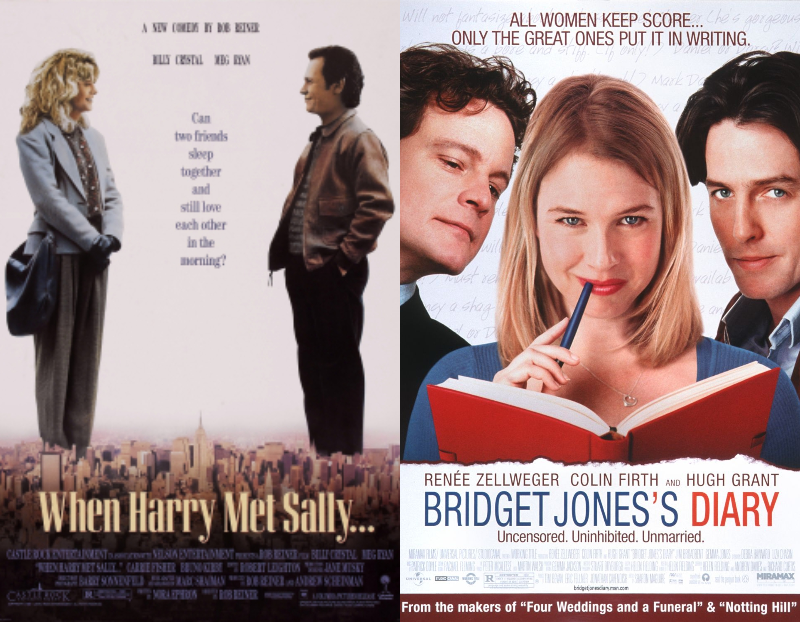

Romantic comedies are a very popular and established genre, in 2019 the genre made [122.34 million in the US box office](https://www.statista.com/statistics/668722/romcom-box-office-gross-north-america/#:~:text=Romantic%20comedies%20generated%20just%20122.34,were%20sold%20in%20that%20year.). It’s easy to see why these films are so popular, they’re generally light easy watches that don’t require you to have a PhD in Film Studies to understand what’s going on.

Much like every genre, romantic comedies have a certain style to their posters. Common colours are white, pink and red with a bit of blue and the imagery on rom-com posters is usually the main characters. Rom-com posters can be quite mixed in terms of typefaces, some opt for the more romantic style of a serif font whereas some go for the more bold sans-serif font.

***When Harry Met Sally***

*When Harry Met Sally* was [written by Nora Ephron, directed by Rob Reiner.](https://www.imdb.com/title/tt0098635/) It was released in 1989 and has gone on to become a film classic. It follows the characters Harry Burns (Billy Crystal) and Sally Albright (Meg Ryan) through the years and how their friendship matures into a relationship.

The poster for When Harry Met Sally uses quite muted tones in terms of the colour palette with creams, browns and light blues. The colour used for the title is also cream to keep in theme with the rest of the poster and the muted tones, it has the hex code of #e0c99b. 

The typeface used for the title is *Corvinus Skyline* which was [designed by Imre Reiner](http://luc.devroye.org/skyline.html) in 1934 and adapted for computers in 1991 by Group Type. This typeface is a serif font that has quite a high x-height. It has a heavy weight and there is also a high contrast between the strokes used to make the letters. It has quite a condensed width which could be symbolic of New York and its cramped nature as an image of the capital sits behind the title. The use of serif font could be to draw together the romantic elements of the movie with the design of the poster as a serif font can often connote ideas of romance.

***Bridget Jones's Diary***