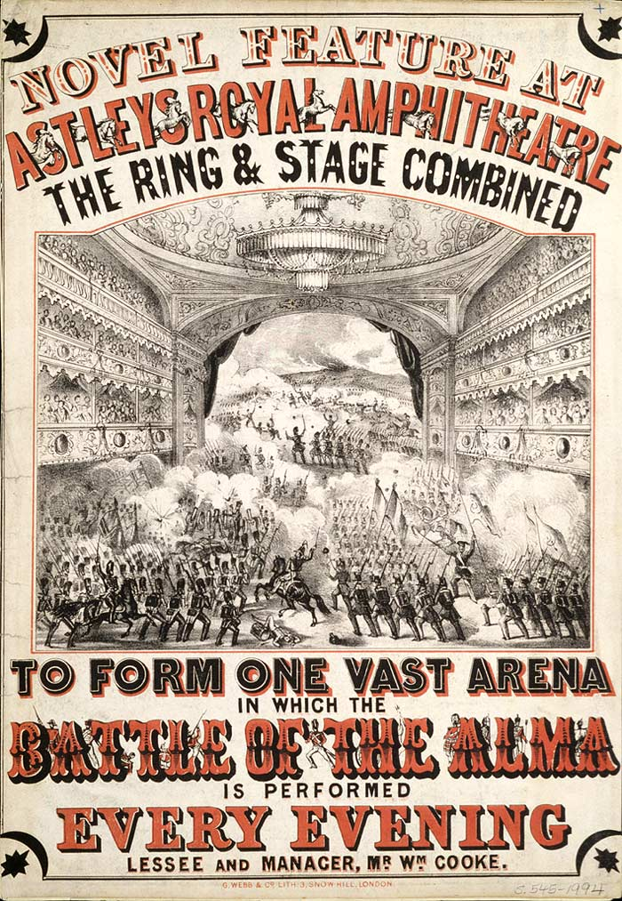

Howdy partners! In this blog post we will be delving into all things Hollywood Westerns. Westerns were a very popular genre in the early to mid 20th century but the popularity declined after that. They are usually set in the American West in the mountain regions that lie west of the Mississippi river, particularly the Great Plains.

Westerns commonly depict the tensions and conflicts between white settlers and Native Americans, also cowboys heavily feature in Westerns.

Western movie posters often come with a very iconic typeface that is easily recognisable. The posters usually feature a certain style of serif font that is synonymous with Westerns. The typeface used on the *Once Upon A Time In The West* film poster is a type of font called ‘[Tuscan](https://woodtype.org/blogs/news/91-antique-tuscans-in-america)’ that belongs to a bigger group of fonts called ‘American Wood Type’. This style of font was very popular in the 19th century which is also the same era that the majority of Westerns are set in. This could be why designers of Western film posters used this style of typeface as is it reminiscent of that particular time period. It is easily identifiable as it has accents on the lettering called ‘spurs’. This feature is very common in ‘American Wood Type’ and is also used in typefaces synonymous with circuses.

**Once Upon A Time In The West**

The typeface used for the *Once Upon A Time In The West* film poster is a very classic Western font that immediately sets the tone of the film. As mentioned before it is a typeface that belongs to the 'Tuscan' family and has the iconic spurs that are synonymous for the genre. The typeface has quite a high x-height as there is not much white space available and any space that is available has been filled with the way the title has been designed. The lettering has a regular weighting, this could be a design choice to keep the basic lettering simple so it’s not overpowering with the additional accents used.

It has a medium contrast as for the most part the thickness of the lettering is pretty much the same, however, as shown with the ‘O’ and the ‘U’ there are much thinner parts which give the typeface a more blocky look. The designer has chosen to condense the lettering and it gives the appearance of being crammed in. This could be a design choice to juxtapose the vast emptiness of the Great Plains in the ‘Wild West’ or it could be because the title is so long that this was the best way for the designer to fit it into a portrait poster.

**The Magnificent Seven**

The typeface for *The Magnificent Seven* is another variation of a classic Western font, however, this time it’s without the spurs. This typeface has a much more bold weighting and is in all capitals which means it has no x-height. It really demands your attention and draws in the audience to the poster. Even with it being such a bold typeface it still belongs to the serif family as it has the strokes used for serif fonts on the lettering. With it being such a bold font it’s not surprising that it has quite a low contrast, there’s not much variation in the width of strokes used to create the lettering. It also has quite a regular width. The typeface has quite a worn and distressed look that connotes the idea of the ‘Wild West’ which was known for being quite a distressed place.

A modern interpretation of this typeface would be ['Magic' by Misprinted Type](https://www.myfonts.com/fonts/misprinted/magic/) which was designed by Eduardo Recife. It is very similar, however, Recife’s is much more distressed in appearance.