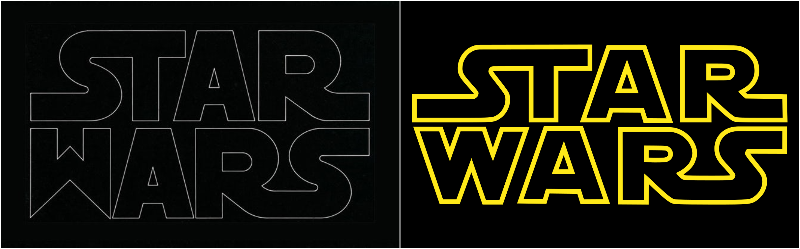
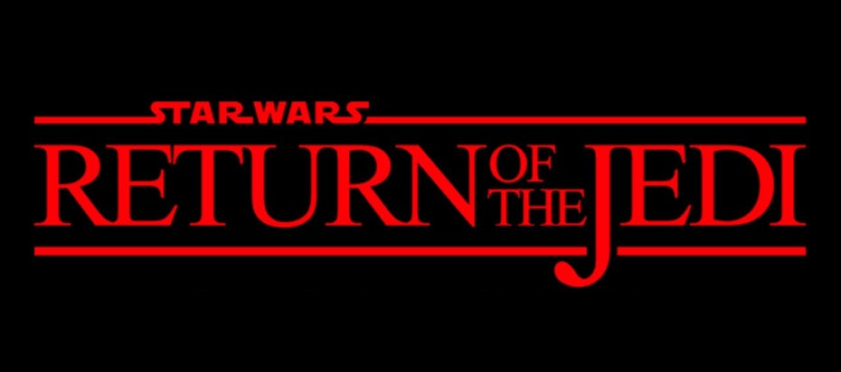

*Star Wars*, a franchise that has spanned 4 decades and captured the hearts of many a geek around the world. But what about the typographical choices that went into making the posters? In this blog post I will discuss the ins and outs of all things Star Wars.

The iconic *Star Wars* logo, much like *Harry Potter*, is actually a logo rather than a typeface. For *Star Wars: A New Hope*, or at the time just *Star Wars*, the logo was [designed by Dan Perri](https://99designs.co.uk/blog/famous-design/star-wars-logos/). His design is very different from the iconic logo we think of today, while the modern logo is flat Dan Perri’s is a different font entirely and is tapered, resembling the crawl of text at the beginning of every Star Wars film. This was the logo that was used on the poster but the film uses the iconic logo we now know today. The typeface used for the text at the bottom of the poster is [ITC Serif Gothic](https://www.fontshop.com/content/star-wars-may-the-fonts-be-with-you), however the upper and lower case ‘e’ on the poster differs slightly from the typeface created by [Lubalin and DeSpigna](https://www.typewolf.com/site-of-the-day/fonts/itc-serif-gothic#:~:text=ITC%20Serif%20Gothic%20is%20a,but%20with%20subtle%20serifs%20added.) as it is more curved. This font will feature again on the posters for the sequel trilogy.

The iconic *Star Wars* logo that was used on all subsequent film posters was created by [Suzy Rice and Joe Johnston](https://99designs.co.uk/blog/famous-design/star-wars-logos/). When George Lucas commissioned Rice to create the logo he asked for one thing, for it to look [‘very fascist’](https://www.vanityfair.com/hollywood/2016/12/star-wars-fascist-logo-inspiration). Incidentally, Rice had been researching about German type design used for Nazi propaganda. She used the techniques she’d learnt to create the logo with harsh lines and a bold standardised font, on her blog she states that she used 'Helvetica Black' as a starting point before molding it into her vision. Joe Johnston modified Rice’s creation slightly, making the logo used on all promotional material for the films and more. 

There wasn’t much consistency within the posters for the first three films. *The Empire Strikes Back* goes in a different direction, the logo is styled in a more fun and adventurous way to reflect the themes of the film. Suzy Rice’s design is still incorporated but in a much smaller way, possibly to distance themselves more from the ‘fascist’ design. *Return of the Jedi* goes a step further and just uses a standard typeface, 'Times New Roman', with the logo being a smaller aspect again.

The prequel trilogy is where the posters start to have some uniformity. The artwork was designed by [Drew Struzan](http://drewstruzan.com/), who also created the first two *Harry Potter* posters, and the typeface used was ['Trajan' and the supporting typeface was 'Albertus'](https://www.fontshop.com/content/star-wars-may-the-fonts-be-with-you). The designers for the prequel trilogy posters decided to feature the episode numbers as the key aspect of the films rather than the name, possibly to highlight the fact they were prequels to the original trilogy. The sequels also have consistency to them, using Suzy Rice’s logo and the typeface ITC Serif Gothic as the main combination. However, this time they have decided to scrap numbering them and have stuck to the name of the film. Though, *Star Wars* is more prominent than the title, which could have been a way to use the *Star Wars* name in order to sell the films.