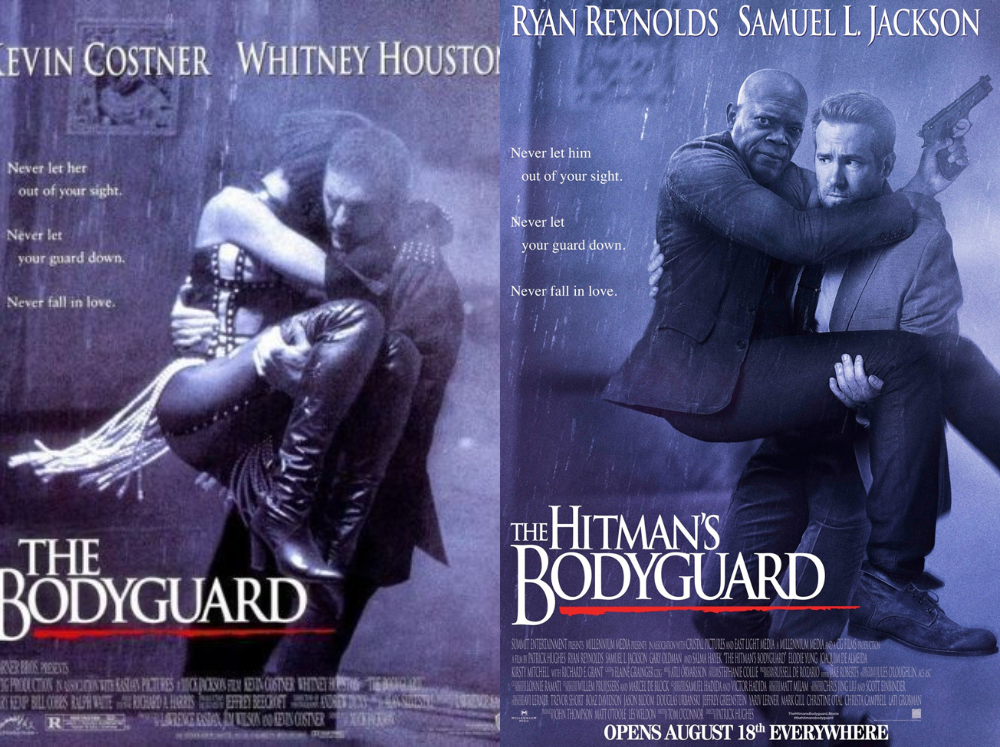
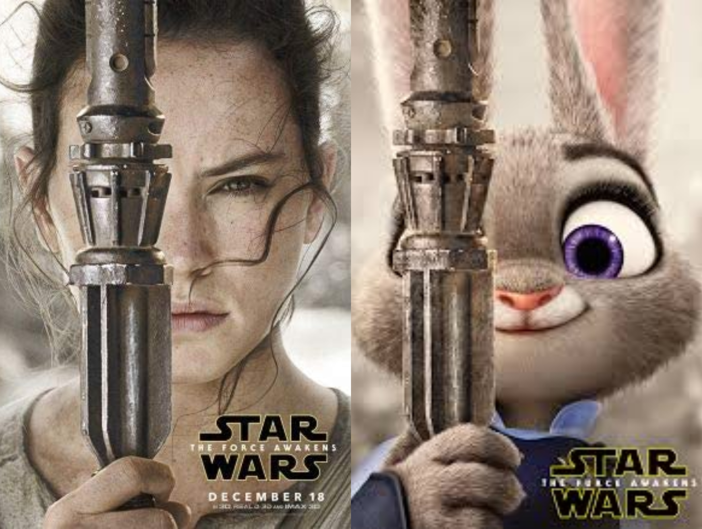

Spoof posters of our favourite films are always a great laugh but what is it that makes them so effective? Parody posters are able to encapsulate the essence of the original poster but put a funny, comedic spin on it. 

The actor Ryan Reynolds often relies on parody in his jokes. Deadpool, which was created by and stars Ryan Reynolds, has many parodies and references within the film and promotional material. Furthering this trend of parody jokes the actor recently starred in The Hitman’s Bodyguard. To promote the film they created a parody poster resembling The Bodyguard poster.

The similarity in the name allows for the perfect motive to create a spoof poster and it is done so well. You know immediately what the poster is meant to be parodying because they have nailed the elements that make up the poster, down to the pose and the font choice. The typeface used for both posters is [Trajan](https://news.avclub.com/heres-how-a-single-font-came-to-dominate-movie-posters-1827234582), a very popular film poster typeface. This font was created by Carol Twombly in 1989.

In Disney’s Zootopia, there is a scene in the film where a rodent is trying to sell counterfeit films, the joke being that they were all animal spoofs of popular Disney films. Audiences loved this scene so to further promote the film Disney released Zootopia themed parody posters of popular films. Some examples being; Star Wars The Furce Awakens, La La Lamb and The Shape of the Water Buffalo. While the titles might not be exactly the same we are able to instantly relate it to the original poster because they replicate the look of it. Typography is a key factor in making parody posters, if you don’t have the right font then it’s not going to resemble its original counterpart.

Star Wars The Furce Awakens uses the iconic logo created by Suzy Rice in order to portray the feel of a Star Wars poster. If the title had been written in any other typeface you probably wouldn’t be able to instantly recognise that it was meant to be parodying a Star Wars poster. This is because we connote the stylised Helvetica font with the Star Wars movies and we know what it is instantly without even needing to read the words ‘Star Wars’. 

This shows that typeface is a key aspect when creating film posters and choosing the right typeface can help to make the poster iconic and recognisable.