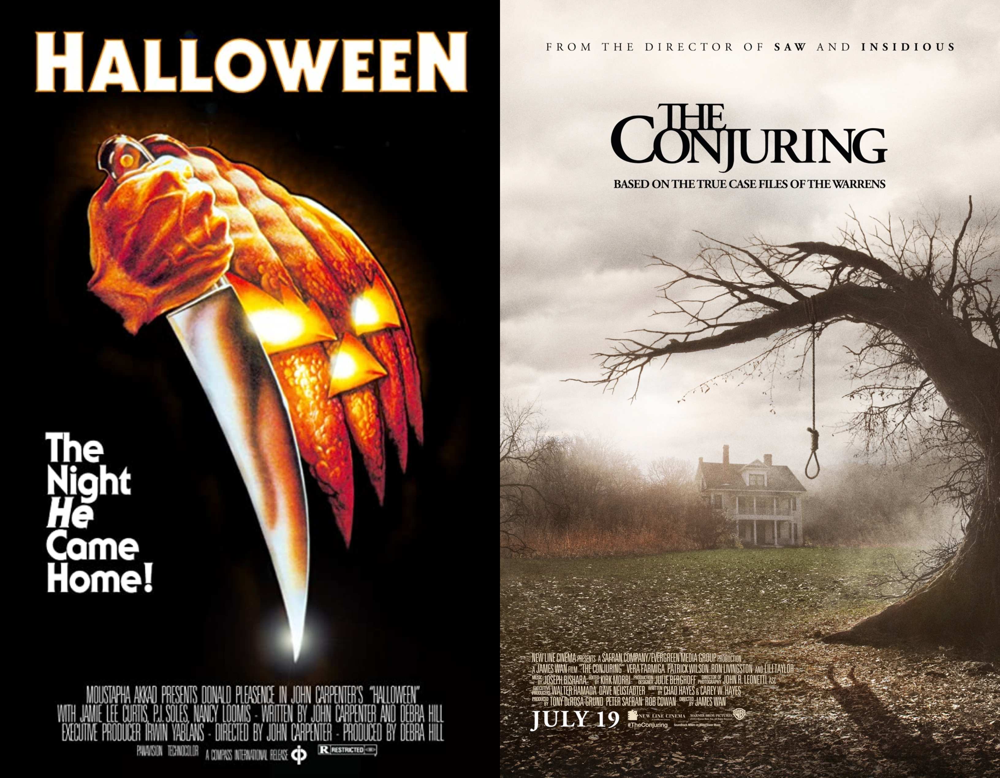
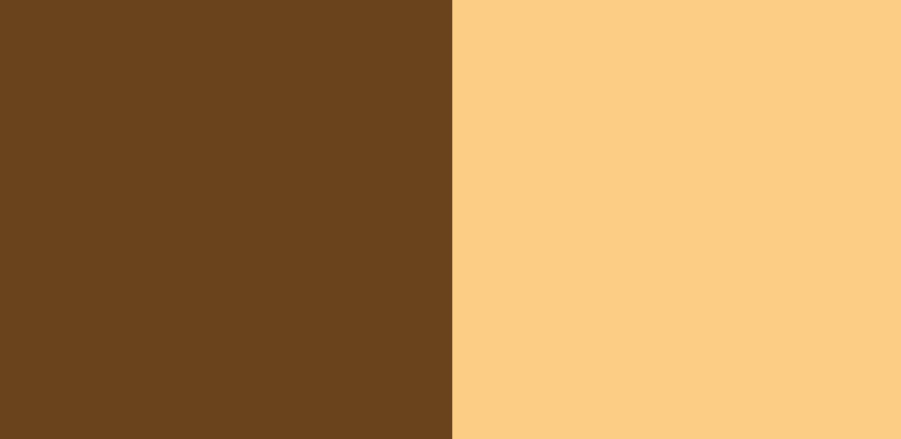
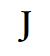

Horror is akin to marmite, you either love it or you hate it. I, for one, cannot stand it, I can count the amount of horror films I have watched on one hand. Something that does fascinate me though is the posters used to promote horror films. They are always full of intrigue and leave me, an avid hater of horror films, wanting to know more.

[Horror](https://www.studiobinder.com/blog/what-is-horror-definition/) as a genre has been around for a long time and it has evolved from literature to film, television and more. They are intended to shock, scare and thrill their audiences. Horror films usually feature a central villain that can be a person, monster or a threat that is a manifestation of society’s fears at the time. Horror is a constantly evolving genre, humans face new threats and fears all the time and horror films usually reflect that change.

**Halloween**

[Halloween](https://www.imdb.com/title/tt0077651/) is an American slasher film directed by John Carpenter, it was released in 1978. The plot follows Michael Myers who has escaped from a mental hospital 15 years after killing his sister. He returns to the small town of Haddonfield, Illinois to kill again.

The film poster for Halloween has three prominent colours; white, black and orange. These colours are most commonly associated with Halloween night so it’s no surprise the designer chose those three colours. The typeface used on the poster [ITC Serif Gothic](https://www.pixartprinting.co.uk/blog/famous-horror-film-fonts/) created by Herb Lubalin and Tony DeSpigna in 1972. This was also the same font used for some of the Star Wars posters. The title is white with an orange outline, the outline is a mixture of #6a431c which is a dark brown and #fbcd85 which is a cream colour. These two colours mixed together create an orange tone which is in keeping with the imagery of the poster.

The poster is very simplistic; a colour scheme consisting of three colours, black background with a simple graphic and not a lot of text. And yet it is very effective, the orange on black draws the audience in and makes them look at the poster.

**The Conjuring**

[The Conjuring](https://m.imdb.com/title/tt1457767/?ref_=fn_al_tt_0) is a supernatural horror film directed by James Wan, it was released in 2013. The plot follows Ed and Lorraine Warren who are paranormal investigators, they go to Rhode Island to help the Perron family who claim their farmhouse is haunted. The film is based on a true story.

The film poster uses very muted colours in its colour scheme. This could be to add to the feeling of suspense and mystery. The typeface used for The Conjuring poster is [Adobe Garamond Semibold](https://fontmeme.com/the-conjuring-film-font/#:~:text=About%20The%20Conjuring%20(film)%20Font&text=The%20film%20title%20on%20the,Old%20Typewriter%20from%20Elsner%2BFlake), however, it has been modified slightly. Typically, the ‘J’ in typeface has a rounded end but on The Conjuring poster the end of the ‘J’ has been cut off and has a blunt end. The title is almost black in colour, it has a hex code of #040406.

Along with the modifications on the ‘J’ the font has also been pushed very close together, with the word ‘The’ connecting. Seeing the typeface pushed so close together gives a sense of claustrophobia and unease which is very effective for a horror poster. It makes the reader feel unsettled and on edge which is exactly how the creators want you to feel.