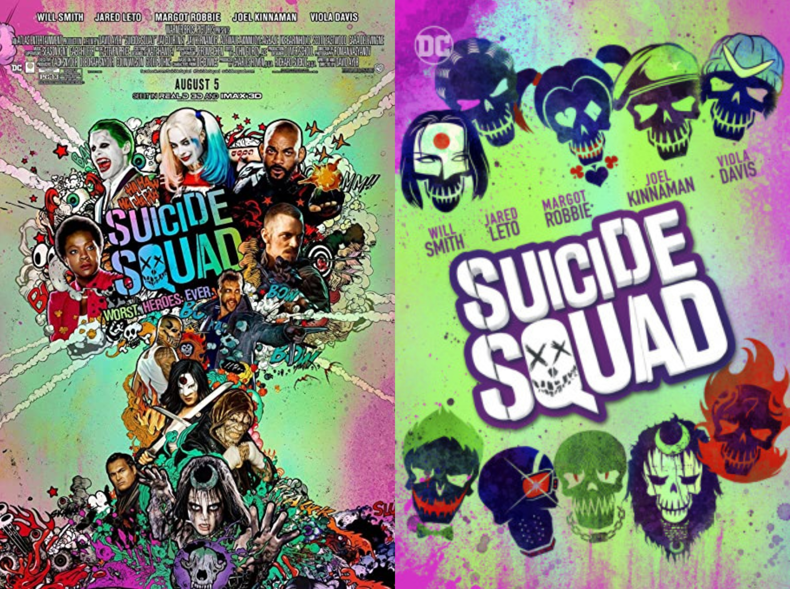
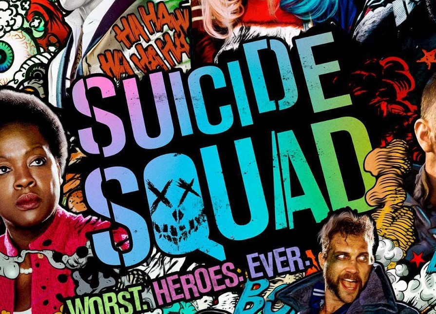
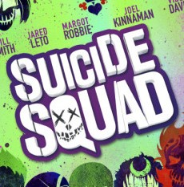
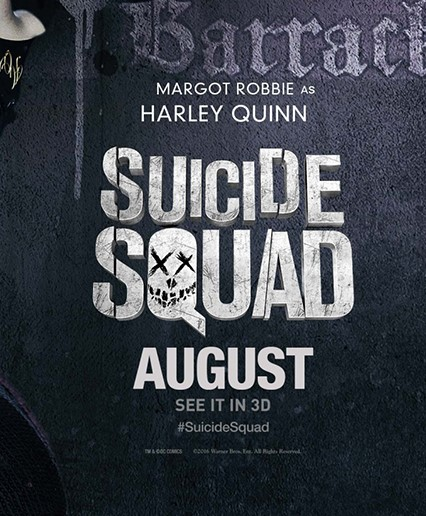

Suicide Squad may not have been the next best superhero movie (or anti-hero to be specific) but the posters for the film are very eye catching and engaging. With its use of bold colours and bold typeface it’s hard to ignore these posters.

Suicide Squad, released in 2016, was[ directed by ](https://www.imdb.com/title/tt1386697/?ref_=fn_al_tt_1)David Ayer and starred many big names such as Will Smith, Margot Robbie and Viola Davis. The plot follows a group of anti-heroes that are teamed up to fight against the villain Enchantress. The film is part of the DC Universe so it features characters like Harley Quinn and The Joker. The film did well in the box office but went on to get quite critical reviews.

The posters used to promote the film are very colourful, using a range of bright colours such as pinks, greens, blues and purples. Depending on the poster these colours are also used on the title as well. The posters also really emphasise the comic book nature that the characters are derived from, using features that are synonymous with comic books themselves. 

The typeface used for the title is a font similar to[ Akzidenz Grotesk Bold Condensed](https://fontmeme.com/suicide-squad-font/). However, the cover design has changed the font and made it a more stylised version. This is seen in the ‘Q’ which has been filled in and features a skull-like face.

There were many different posters created to promote the film, with three different sets of posters promoting each character individually in different styles, one of which being the bright, colourful comic book style seen in the rest of the promotional material. The title for all of the posters is set out in different ways. On the main promotion poster it has the bright colours with a black background. 

On the poster that features the characters as graphic skulls the title is white on a purple background. 

And on the individual character posters the title is white with a distressed texture.

The promotional material was, arguably, very strong for Suicide Squad so it’s a shame that the movie didn’t reflect the same quality.