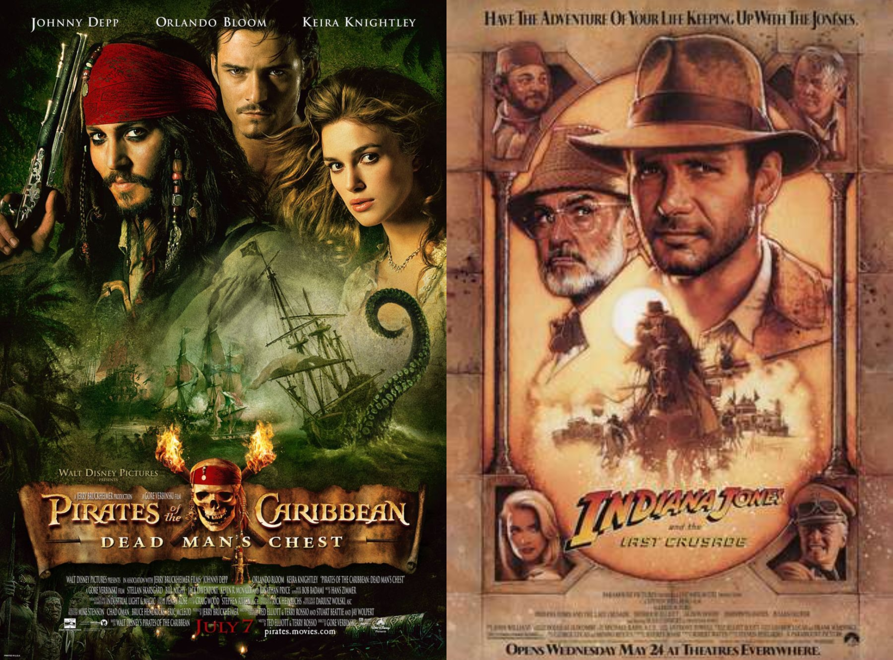

Adventure, much like horror, is a well established genre within film. [Action and adventure](https://www.filmsite.org/adventurefilms.html) are very similar in terms of structure, however, action films rely more on violence whereas adventure is more about following along on a journey. Common themes in adventure films are pirates/swashbucklers, search and expedition, jungle and desert epics, and treasure hunts and quests. 

Many adventure films have a similar pattern when it comes to typefaces. I’d say there are three main varieties; arguably the most common is a bold, blocky serif font that has a gradient from yellow to orange. Then you have a thin serif font that is distressed in some way which fits well with pirate films. Lastly, you have a generic thin serif font that is often gold in colour. These three styles crop up very often with adventures films. However, the consistency in font styles does allow people to instantly recognise what genre the film is and what kind of theme the film will have. So, it could be considered a good thing that these film posters share such similarities as it means the poster designs are doing their job well.

**Indiana Jones**

Indiana Jones is a series of adventure films, the first being [Raiders of the Lost Ark.](https://m.imdb.com/title/tt0082971/?ref_=fn_al_tt_0) It was directed by Steven Spielberg and was released in 1981. The films follow Indiana Jones who is an archaeologist and adventurer on his many adventures.

There are two different typefaces used on the Indiana Jones’ posters. The first is a [custom made font](https://fontmeme.com/indiana-jones-font/#:~:text=About%20Indiana%20Jones%20Font&text=The%20Indiana%20Jones%20logo%20was,download%20them%20for%20free%20here) used for the ‘Indiana Jones’ part. It is a novelty font which is quite bold. It also tapers in size, the height of the first letter ‘I’ is much larger than the height of the last ‘S’. The words also have a gradient from orange to white and a black outline. While you can’t get the exact font used for the posters you can one that is very similar called SF Fedora created by ShyFonts. The second typeface used for the rest of the title is one very similar to [Venture](http://davidocchino.com/portfolio/typography/venture-font-art/indiana-jones-subtitles-font.html) created by David Occhino. It is a sans-serif font with a low contrast. 

**Pirates of the Caribbean**

[Pirates of the Caribbean](https://m.imdb.com/title/tt0325980/?ref_=fn_al_tt_0) is also a series of adventure films, much like Indiana Jones. The first film, Pirates of the Caribbean: The Curse of the Black Pearl came out in 2003 and was directed by Gore Verbinski. It follows Captain Jack Sparrow who teams up with Will Turner to save his love Elizabeth Swann.

The typeface used for the Pirates of the Carribean film posters is also a [custom font](https://fontmeme.com/pirates-of-the-caribbean-font/#:~:text=The%20title%20of%20the%20film,the%20font%20for%20free%20here) created specifically for the film. It is a serif font that also has certain gothic elements to it as seen with the ‘A’ and the extended part of the ‘R’. The font is also distressed which adds to the theme of pirates. The typeface has a regular weighting and a high contrast. There is a font called Caribbean designed by Mseek which looks very much like the typeface used for these films.