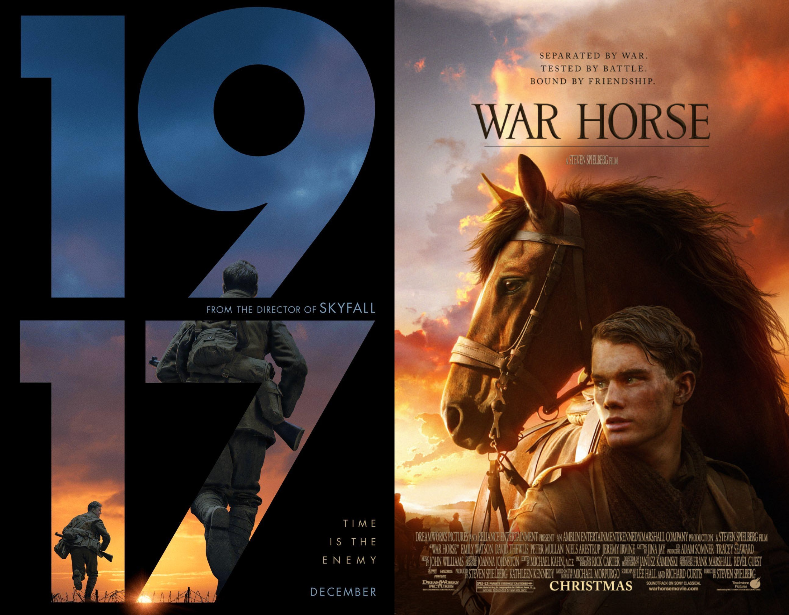

War films have been a[ popular genre](https://www.encyclopedia.com/arts/encyclopedias-almanacs-transcripts-and-maps/war-films) since the creation of film in the late 1800s. There are films about war from around the world because everyone’s perception and experience of war is completely different. Also, wars feature in many different genres as well such as westerns (cowboys shoot outs), science fiction (Star Wars is based on an imaginary intergalactic war) and costume dramas.

War films are repeatedly made for multiple reasons but two key reasons are Academy Awards and box office returns. War films consistently do exceptionally well during awards season, recent examples being 1917 which won 90 awards in total, 3 from the Academy Awards and 7 from the BAFTA’s and Dunkirk which 40 awards in total, 4 from the Academy Awards and 1 from the BAFTA’s. They also generate a lot of revenue as they are generally a crowd pleaser.

War film posters have a mixture of serif and sans-serif typefaces, though sans-serif seems to be more in trend at the moment with both Dunkirk and 1917 using sans-serif typefaces.

**1917**

The film poster for [1917 ](https://m.imdb.com/title/tt8579674/?ref_=fn_al_tt_0)is very interesting and unique. Instead of the title taking up a small portion of the poster 1917’s title is the poster. The typeface used for ‘1917’ is[ Futura Bold](https://www.myfonts.com/fonts/urw/futura/t-bold/) and the rest of the poster uses [Futura PT ](https://fonts.adobe.com/fonts/futura-pt)Medium. Futura Bold is trademarked by URW Type Foundry and Futura PT is trademarked by Bauer Types but used by Adobe. Futura Bold and Futura PT Medium are both sans-serif fonts and have relatively low contrast. On the poster, the width of the phrase ‘Time is the enemy’ is more extended compared to the rest of words. 

The designer has chosen to put the title on a black background and have the imagery within the numbers ‘1917’. The blues and oranges of the image against a black background create quite a stark contrast which is engaging to look at. The simplicity of the poster is still incredibly effective, even when there’s not much to look at visually.

**War Horse**

War Horse was [directed by](https://www.imdb.com/title/tt1568911/) Steven Spielberg and was released in 2011. It follows a young man who enlists to serve in World War 1 after his horse is sold to the cavalry.

The poster for War Horse utilises warm tones in its colour palette such as brown and orange. The typeface used for the poster is very similar to [Cochin](https://www.myfonts.com/fonts/linotype/cochin/). Cochin is a serif typeface created by [Georges Peignot](https://www.typewolf.com/cochin) in 1913 and revised by Matthew Carter in 1977. While it is not exactly the same it is a very close match for the typeface used on the War Horse poster. The typeface has a medium contrast in the width of letters and has a thin weighting. A serif font lends itself nicely to the idea of tradition and older times, it’s not as modern as a sans-serif font. So the use of it on this particular war film works well and allows the poster to be cohesive.