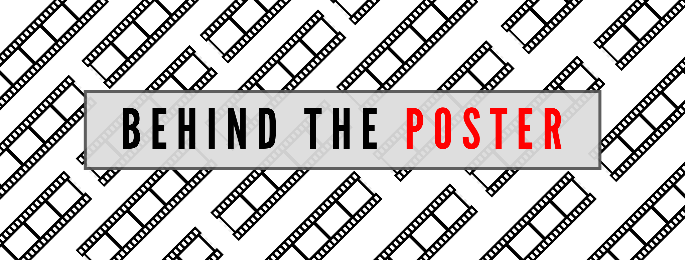

Welcome to Behind The Poster, a blog all about the typographical choices made on movie posters. 

There are many aspects that make up a good movie poster, one of which being the typeface. Having a good typeface can make or break a poster. A typeface that matches the theme of the movie, and is cohesive, is vital when creating a successful movie poster. This is the content I plan to discuss in my blog posts; whether or not designers have well executed their choice of typography and what do the choices help to convey to the audience.

There are multiple different genres in film and with those genres comes certain design choices that are synonymous with specific genres. For instance, action films will usually have quite dark colours with orange hues and sans-serif typefaces. Whereas horror films often have dark or black backgrounds with serif typefaces. The choice of typeface on a movie poster can tell the audience a great deal about what the movie is about and what they would expect.

Through socialisation we as humans have been conditioned to understand why certain design choices have been made and what those choices signify. It is through this process that we can understand why a serif font lends itself better to a lighter, more comedic film whereas a sans-serif lends itself better to films with for hard-hitting content. However, there can be exceptions to the rule. For example, the film *All The Money In The World* has two different widely used posters; one which uses a serif font and one which uses a sans-serif font. These stylistic choices will be used in different ways to invoke different emotions.

Typographical choices are a crucial aspect to think about when designing a film poster. You've got to make sure that the typeface you are using is signifying the right genre and invoking the right emotion is key to creating a successful, cohesive poster.

## **My design**

For my blog I chose to use a clapperboard style logo to be in keeping with idea of film posters. Clapperboards are synonymous with films and instantly convey to the audience what my blog entails. The typeface used for the logo is League Gothic which is a revival of an old classic typeface Alternative Gothic No.1. I chose to use the initials of Behind the Poster as it is more legible when on a small logo.

For the landing page image I also decided to stick with the theme of film symbolism and used film strips to create the background. The typeface, like the logo, is also League Gothic as it creates a more streamlined effect when the typefaces are the same. I chose to use a sans-serif font such as League Gothic as it gives a more modern look to the website which is key when the theme of the blog is quite broad. Had I chosen to do a specific genre within film I could have tailored it more towards that genre but as I chose to be broad the typeface needed to be in keeping with that decision.

I chose a simple colour scheme of black, white, grey and red to keep it quite simple and seamless. I feel that if it had more colour it would detract from the film posters and too much colour can become distracting so keeping it simple seemed like the best idea.